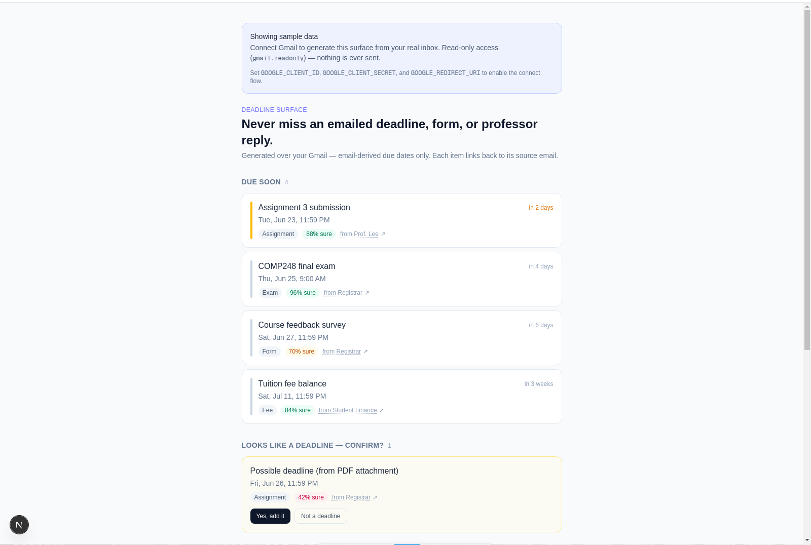

# Deadline Surface

> **Never miss an emailed deadline, form, or professor reply.**

A student's coding agent **generates** a deadline surface over their Gmail — email-derived due dates, event RSVPs, forms to submit, and professor threads needing a reply — instead of yet another generic inbox. Connect your account **read-only** and the homepage becomes a ranked, provenance-linked view of what's actually due.

The honest framing: email is the *notification layer*, not the source of truth. So the promise is "never miss an **emailed** deadline" — not "every deadline you have."

<p align="center">
  
</p>

> The wedge: Gemini Spark automates *inside* one fixed inbox shape. **Deadline Surface changes the *shape* of the inbox per person.**

This repo is the **docs + code scaffold** for the 6-week test described in [`docs/FINAL-PLAN.md`](docs/FINAL-PLAN.md). It is built **extraction-first**: the load-bearing question is whether extraction clears a per-category accuracy gate on real inboxes *before* any surface is worth building.

---

## Highlights

- **Read-only by construction.** Connecting Gmail uses the `gmail.readonly` scope only. The client calls `users.messages.list/get` and nothing else — there is no send or modify path in the read flow.
- **Confidence-gated.** Low-confidence guesses never silently appear or vanish. They surface in a **"Looks like a deadline — confirm?"** lane (confirm → promote, dismiss → gone).
- **Provenance on every item.** Each deadline/event/reply links back to its source email — no unsourced claims.
- **Trust rails on every write.** Replies and calendar adds travel **preview → approve → undo → audit**. Nothing auto-sends; there is no batch approve.
- **An accuracy gate, not a vibe.** `npm run eval` runs per-category recall **and** precision floors weighted by harm, and exits non-zero on KILL so it can gate CI.

---

## Quick start

```bash
npm install
npm run dev      # http://localhost:3000 — the surface, rendered from sample data
npm run eval     # the extraction eval + GO/KILL gate against labeled fixtures
npm run build    # production build
npm run lint     # eslint
```

With no credentials set, the homepage renders from `src/lib/sample-data.ts` and shows a **Connect Gmail** prompt. The sample surface already demonstrates the shadow paths: a low-confidence item in the "confirm?" lane, and a drafted reply that walks **preview → approve → send → undo**.

### Connect a real inbox (read-only)

1. In [Google Cloud Console](https://console.cloud.google.com/), create a project and **enable the Gmail API**.
2. Configure the **OAuth consent screen** (External): add the `gmail.readonly` scope and add yourself as a **test user**. Keep the publishing status on **"Testing"** — that lets you use the restricted read-only scope with up to 100 test users *without* a CASA assessment (§2/§9.3).
3. Create an **OAuth client ID** (Web application) and add this authorized redirect URI:
   ```
   http://localhost:3000/api/gmail/callback
   ```
4. Set the env vars and start the app:
   ```bash
   export GOOGLE_CLIENT_ID=...
   export GOOGLE_CLIENT_SECRET=...
   export GOOGLE_REDIRECT_URI=http://localhost:3000/api/gmail/callback
   npm run dev
   ```
5. Open http://localhost:3000 → **Connect Gmail (read-only)** → grant consent. The homepage now generates the surface from your last 60 days of mail. **Disconnect** drops the stored token.

> Tokens persist to a gitignored `.data/gmail-tokens.json` (a scaffold store for a single tester — production retention/encryption is the open §9.4 decision). Only OAuth tokens are stored locally, never raw email. **Do not commit real student mail.**

---

## How it works

Surfaces never read raw Gmail. Everything flows through one stable internal model (§5), so a Gmail API change touches only the normalizer:

```
GMAIL API ─▶ NORMALIZER ─▶ INTERNAL MODEL ─▶ EXTRACTOR ─▶ GENERATED SURFACE
              (gmail/)       (model.ts)       (extraction/)   (components/)
                                  │
                                  ├─ Message   {id, thread, from, subject, body, date, labels}
                                  ├─ Person    {email, name, role_guess}
                                  ├─ Deadline  {title, due_at, category, source_msg_id, confidence}
                                  ├─ Event     {title, starts_at, source_msg_id, confidence}
                                  └─ Action    {type: reply|calendar, status: proposed|approved|done|undone}
```

The live read path: `/api/gmail/auth` redirects into Google consent → `/api/gmail/callback` exchanges the code and stores the token → the homepage calls `buildLiveModel()`, which pulls recent messages (`createGmailClient` → `users.messages.list/get`), normalizes them, runs the extractor, and renders the surface.

### Project layout

| Area | Path | Status |
|---|---|---|
| Internal model (the stable substrate, §5) | `src/lib/model.ts` | ✅ implemented |
| Gmail normalizer (raw Gmail → model) | `src/lib/gmail/normalizer.ts` | ✅ implemented |
| OAuth scopes (read-only first, incremental) | `src/lib/gmail/scopes.ts` | ✅ implemented |
| OAuth flow (consent + token exchange + storage) | `src/lib/gmail/tokens.ts`, `src/app/api/gmail/{auth,callback,disconnect}` | ✅ live (read-only) |
| Gmail client + historical pull → live model | `src/lib/gmail/{client,ingest,live}.ts` | ✅ live read-only |
| Live delta ingestion (Pub/Sub watch + history.list) | `src/lib/gmail/ingest.ts` | 🟡 stub (notes) |
| Extraction — heuristic baseline | `src/lib/extraction/heuristic.ts` | ✅ runnable, zero creds |
| Extraction — LLM/hybrid | `src/lib/extraction/llm.ts` | 🟡 stub (seam + privacy note) |
| Eval harness + GO/KILL gate (§7) | `eval/` | ✅ `npm run eval` |
| Surface UI (Due soon / Events / Needs a reply) | `src/components/Surface.tsx` | ✅ sample + live |
| Write-action trust rails (§6) | `src/lib/actions/rails.ts` | ✅ implemented |

🟡 stubs are intentional seams: they throw a clear "not implemented" error pointing at the open plan question that gates them (live delta §9.2, LLM/hybrid architecture §9.1, privacy/retention §9.4).

---

## The extraction gate (the load-bearing test, §4 week 3 / §7)

```bash
npm run eval
```

Loads every labeled inbox in `eval/fixtures/*.json`, runs an `Extractor`, matches predictions to gold **per category**, and prints a GO/KILL report. The gate (`eval/gate.ts`) is **per-category recall AND precision floors**, weighted by harm — missing an exam ≫ duplicating an RSVP. A single blended "80%" is **banned** because it hides the failures that matter.

```
category     recall   precision   verdict
exam         ≥95%      ≥85%       ...
assignment   ≥90%      ≥80%       ...
fee          ≥90%      ≥80%       ...
form         ≥80%      ≥75%       ...
rsvp         ≥70%      ≥70%       ...
```

> Retention is deliberately **not** in the gate: at N=5 it is anecdote, not a build/kill signal. Recruit ~15–20 testers before any retention number counts (§7).

---

## Trust & safety

- **Read-only first.** Day-one consent is `gmail.readonly`. Write/compose scopes are requested incrementally, at first use — never on the day-one screen.
- **Nothing auto-sends.** Every write (reply / calendar) requires **preview the exact payload → explicit per-action approval → undo → audit log**. See `src/lib/actions/rails.ts`. A write that can happen without preview + approval + undo is a critical gap.
- **`gmail.compose` stays off.** It is gated behind `COMPOSE_ENABLED` (default off) and the CASA restricted-scope assessment path (§2, §8).

---

## Tech stack

Next.js 15 (App Router) · React 19 · TypeScript · Tailwind CSS v4 · [`googleapis`](https://www.npmjs.com/package/googleapis) (read-only Gmail) · `tsx` (eval harness).

---

## Roadmap & open questions

**Out of scope for the test (§8):** 3 surface modes · learning loop · syllabus/LMS/PDF import · other personas · owning the primitive substrate · `gmail.compose`/send in production (until the CASA path is confirmed).

**Open questions before further implementation (§9):** extraction architecture (LLM-only vs hybrid) · live ingestion mechanics (Pub/Sub + watch + polling) · OAuth/CASA path · privacy/retention · per-user LLM cost.

---

## Docs

- [`docs/FINAL-PLAN.md`](docs/FINAL-PLAN.md) — the reviewed, locked plan (source of truth).
- [`docs/architecture.md`](docs/architecture.md) — how the plan maps to this code.
